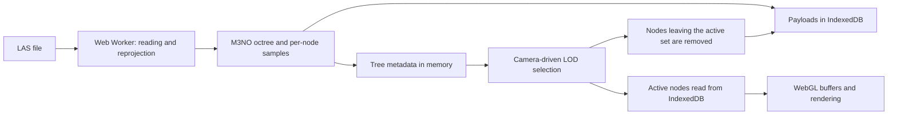

# M3NO Point Structure and Level-of-Detail Scheme

## 1. Purpose and terminology

This document describes PointScape's current **M3NO** point structure, its
level-of-detail (LOD) scheme, and the node loading and unloading lifecycle. The
name “M3neo” is sometimes used to refer to this structure; the project source
code and user interface use the name `M3NO`.

The implementation is mainly distributed across:

- `pointscape-octree-builder.js`: LAS reading, tree construction, and sample
  generation;
- `pointscape-lod-system.js` and `tile-selection.js`: active-node selection;
- `pointscape-data-ingestion.js`: Web Worker execution and temporary IndexedDB
  storage;
- `script.js`: selection coordination, point retrieval, and WebGL buffer
  management.

## 2. Overview

M3NO organizes each LAS file as a **spatial octree**. The file's occupied volume
is split in half along the X, Y, and Z axes, so each node can have up to eight
children. Every node contains a sampled representation of its volume, while
leaf nodes also retain the full-resolution points.

The LOD is **accumulated**: expanding a node does not completely replace its
sample with its children. The parent points remain active and the relevant
descendant nodes are added, so each level contributes additional detail.

Expansion is based on the node's apparent angular size from the camera. A node
opens when its diagonal occupies a sufficiently large angle. Detail therefore
increases as the camera approaches and decreases as it moves away.



## 3. Building the M3NO structure

### 3.1. Root volume and depth

One root is created for each file, with the identifier `<fileIndex>:m3no`. Its
horizontal bounds come from the LAS envelope, and its vertical bounds come from
`minZ` and `maxZ`. A margin of 0.01 units is introduced when any dimension is
degenerate, preventing a zero-size volume.

The effective maximum depth is calculated from the root's three-dimensional
diagonal:

```text
D = sqrt((maxX-minX)² + (maxY-minY)² + (maxZ-minZ)²)
```

Subdivision continues while `D / 2^level` is greater than the minimum diagonal
and the configured maximum depth has not been reached. The current values are:

| Parameter | Value | Purpose |
|---|---:|---|
| `tileMinDiagonalMeters` | 100 m | Stops subdivision based on size |
| `tileMaxDepth` | 8 | Limits tree depth |
| `m3noGridCellsPerAxis` | 32 | Sets the sampling-grid resolution per node |

The tree may be shallower than eight levels if the minimum size is reached
first. Only children that receive points are materialized, so the tree is
sparse.

### 3.2. Division into eight octants

Each node is divided at the midpoints of X, Y, and Z. The child index is
calculated by adding:

- `1` when the point lies in the eastern half;
- `2` when it lies in the northern half;
- `4` when it lies in the upper half.

The result ranges from 0 to 7. Identifiers encode the traversal path, for
example `0:m3no.5.2`.

### 3.3. Per-node spatial sample

Every node has a regular `32 × 32 × 32` cell grid. Each cell retains at most one
representative: the point closest to the cell center.

A point is inserted as follows:

1. Its cell is located in the current node's grid.
2. If the cell is empty, the point remains in the node and its traversal ends.
3. If the cell already has a representative, the point closest to the center is
   retained.
4. The point displaced from that cell—either the new point or the previous
   representative—continues into the corresponding child octant.
5. The process repeats until the point finds an empty cell or reaches a leaf.

This policy progressively distributes representatives across levels. Upper
levels provide coarse spatial coverage, while lower levels hold detail that
does not fit into that coverage. A point may be lost from the **sample** because
of a collision at a leaf, but it is not lost from the full-resolution data
described below.

The `tileSamplePoints = 25000` limit is used by QuadTree mode through reservoir
sampling, but it does **not directly limit an M3NO sample**. In M3NO, the
theoretical per-node limit is set by the 32³ cells: 32,768 representatives.
Most nodes will normally contain many empty cells.

### 3.4. Full resolution in leaf nodes

In parallel with sampling, every valid point traverses the octree to its leaf
and is added to `fullPoints`. Consequently:

- internal nodes contain samples;
- leaf nodes contain a sample and all of their original points in `fullPoints`;
- the **Full points when close** option, enabled by default, makes a leaf use
  `fullPoints` instead of its sample.

Because M3NO uses accumulated LOD, ancestor samples remain active while a leaf
is drawn at full resolution. Those representatives may also be present in the
leaf's `fullPoints`; the current implementation does not deduplicate points
across levels.

### 3.5. Node record contents

Each node produces a record with two kinds of information:

- **Metadata:** identifier, parent, children, source file, depth, bounds,
  diagonal, center, corners, Z range, point counts, and CRS.
- **Payload:** `points` for the sample and `fullPoints` for leaf-node full
  resolution.

Points are packed into typed arrays:

- `Float64Array`: longitude, latitude, and altitude, with three values per
  point;
- `Uint8Array`: LAS classification, with one value per point.

Descriptive indexes are also stored for minimum/maximum altitude and the LAS
classes present in the subtree. These indexes are part of the record but
currently **do not affect the LOD criterion**.

## 4. LOD scheme

### 4.1. Expansion metric

For each node, the system calculates its three-dimensional diagonal `D` and the
distance `d` from an approximate camera position to the node's bounding box.
The distance along a dimension is zero when the camera falls within the box's
range on that dimension. Angular size is estimated as:

```text
angle = 2 · atan(D / (2 · d))
```

The result is expressed in degrees. A node that is not already expanded opens
when:

```text
angle >= 15°
```

No fixed distance is used. Two equally sized nodes refine at similar distances,
whereas a larger node may refine from farther away.

### 4.2. Hysteresis

To prevent oscillation near the threshold as the camera moves, an already
expanded node does not collapse immediately after crossing below 15°. With 10%
hysteresis, it remains open until the angle falls below:

```text
15° · (1 - 0.10) = 13.5°
```

Therefore:

- initial expansion: 15° or more;
- expanded state retained: 13.5° or more;
- collapse: less than 13.5°.

### 4.3. Accumulated traversal

Selection starts at the roots. For each visible node:

1. The node itself is added to the active set.
2. Traversal stops if it has no children or does not meet the angular threshold.
3. Its children are traversed if it should expand.
4. Each visible child is added and may in turn be expanded.

The essential difference from QuadTree mode is that M3NO keeps the parent active
when expanding it. In QuadTree mode, the children replace the parent.

### 4.4. Visibility and camera position

Camera position is approximated from the map center, zoom, viewport size, field
of view, pitch, and bearing. It is then transformed into the node's metric CRS.

When map pitch exceeds 1°, a node is discarded if all four corners of its
horizontal box are completely behind the viewing direction. There is currently
no full side-frustum test or global point budget. The angular threshold is the
primary decision criterion, complemented by this behind-camera culling.

## 5. Loading points

### 5.1. Initial indexing

When one or more LAS files are selected:

1. The previous temporary tile database is cleared.
2. The in-memory index, LOD state, and WebGL buffers are reset.
3. Each file is read as an `ArrayBuffer`.
4. The buffer is transferred to a Web Worker.
5. The worker validates the LAS, detects its CRS, projects the points, and
   builds the M3NO octree.
6. Records are stored in IndexedDB in batches of 24.
7. After storage, point payloads are stripped from the in-memory records.
8. Only tree metadata remains persistently in RAM.

Buffers are transferred between the main thread and worker, avoiding additional
copies during transport. Progressive preview is implemented but currently
disabled (`progressiveLoadingPreview = false`), so normal visualization starts
after file indexing finishes.

### 5.2. Activation during navigation

Selection is recalculated:

- after a map movement ends (`moveend`), with an 80 ms delay;
- when LOD controls or the full-resolution option change;
- after a point cloud finishes loading;
- when elevation changes or geometry must be rebuilt.

Each update has an identifier. If the camera changes again before an
asynchronous read finishes, the stale result is ignored.

After obtaining the active-node list:

1. A render key records whether each node uses its sample or full resolution,
   along with its point count.
2. Nodes that already have a valid WebGL buffer are reused.
3. Only missing payloads are requested from IndexedDB.
4. Retrieved arrays are converted into WebGL vertex buffers.
5. A new map render is requested.

If a payload is not yet available—a possibility during progressive loading—the
system retries after 120 ms. The previous representation remains visible while
no new node can be rendered.

## 6. Unloading and replacing points

Three residency levels must be distinguished:

| Level | Contents | Release condition |
|---|---|---|
| In-memory index | Metadata for every node | Another cloud is loaded or state is reset |
| IndexedDB | Samples and full-resolution points | Another cloud is loaded; this is temporary session storage |
| Active RAM and GPU | Payloads and buffers for visible nodes | A node leaves the active set |

After every LOD selection, the WebGL layer compares the previous set with the
new one:

- buffers whose node and render key have not changed are retained;
- buffers for nodes that are no longer active are removed with
  `gl.deleteBuffer`;
- a buffer is replaced when its node changes from sample to full resolution, or
  vice versa;
- buffers are created only for new or modified nodes.

The GPU unloading criterion is therefore straightforward: **a node is unloaded
when it is no longer selected by the LOD traversal or when its representation
changes**. There is no LRU policy, explicit memory cap, or maximum point budget.

GPU unloading does not delete the node from IndexedDB. If it becomes necessary
again, it is retrieved from storage without rereading or reindexing the LAS.
Loading a new cloud clears IndexedDB and forcibly removes all previous buffers.

## 7. Criterion summary

The complete policy can be summarized as follows:

- **Structure:** sparse 3D octree with one root per file.
- **Sampling:** 32³ grid per node; the point closest to each cell center is
  retained and overflow points descend.
- **Full detail:** all original points are stored in leaf nodes.
- **LOD:** accumulated; children add detail without removing their parents.
- **Expansion:** angular diagonal of at least 15°.
- **Collapse:** angular diagonal below 13.5° for a previously expanded node.
- **Culling:** boxes completely behind a pitched camera are excluded.
- **Loading:** only active nodes without a valid WebGL buffer are retrieved from
  IndexedDB.
- **Unloading:** nodes that leave the active set are removed from active RAM and
  GPU memory, but remain in IndexedDB.
- **No global budget:** active point count follows from the angular threshold,
  tree geometry, and leaf-node full resolution.
